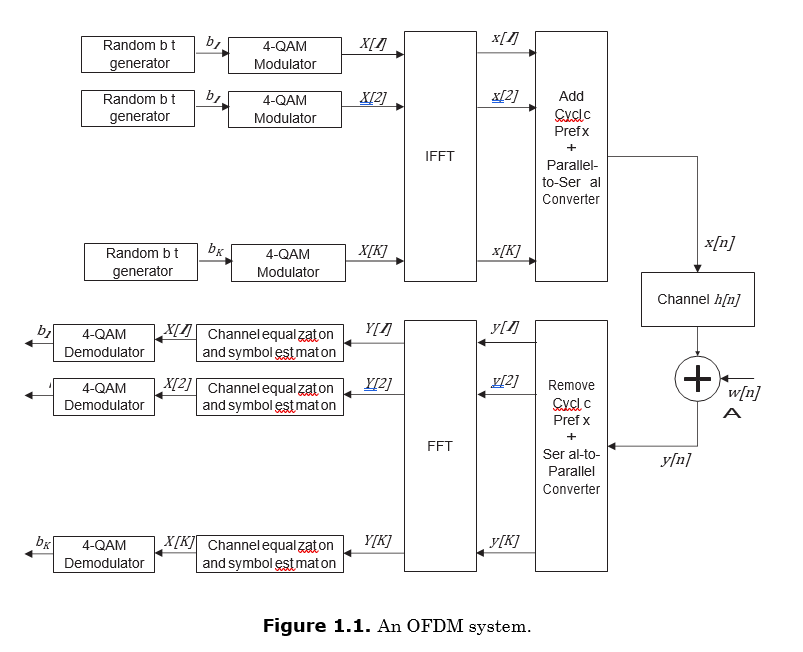

# OFDM Flow Chart

# Note for Parameters

@param choice_pilots: Pivots sets. Values are [A,B] 

@param choice_channel: 1/4/8-tap multipath channel. Values are [A,B,C] 

@param subc: select subcarriers, values are in range(1,64) inclusive. [10,25] for question prompt

@param snr: snr. [5,10]db for question prompt

